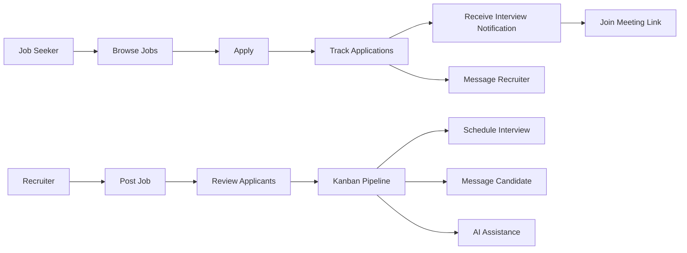

# SkillSync

SkillSync is a full-stack hiring platform that connects recruiters and job seekers in one workflow. It covers job posting, applications, interview scheduling, direct messaging, notifications, profile management, and AI-assisted recruiter tools.

The project is designed to feel like a real product rather than a demo shell. Recruiters can manage applicants through a kanban-style pipeline, schedule interviews, message candidates, and use AI to assist with decision-making. Job seekers can browse roles, apply, track applications, join interviews through pasted meeting links, and message recruiters directly.

## Product Flow



## Wireframe

### Job Seeker Experience

```text
Login / Register
      |
Dashboard
      |
Jobs -> Apply -> My Applications
                      |
                      +-> Interview notification
                      +-> Join meeting link
                      +-> Message recruiter
```

### Recruiter Experience

```text
Recruiter Dashboard
      |
Post Job
      |
Applicants / Kanban Board
      |
      +-> Move candidate across stages
      +-> Schedule interview
      +-> Message candidate
      +-> Use AI recruiter assistant
```

## Core Features

- Authentication and role-based access for job seekers, recruiters, and admins
- Job posting and job browsing
- Application tracking and saved jobs
- Kanban-based recruiter pipeline for applicant management
- Manual interview scheduling with meeting link support
- Real-time messaging between recruiters and job seekers
- Notifications for applications and interviews
- Profile management for both user types
- AI-assisted recruiter chat for applicant insights

## Tech Stack

### Backend

- Node.js
- Express
- MongoDB
- Mongoose
- Socket.IO
- Passport.js
- Cloudinary
- Nodemailer
- Gemini AI integration

### Frontend

- React
- Vite
- Redux Toolkit
- React Router
- Tailwind CSS
- Socket.IO client
- React Hook Form
- React Icons and Lucide icons

## Project Structure

```text
SkillSync/
|-- Backend/
|   |-- controllers/
|   |-- services/
|   |-- models/
|   |-- routes/
|   |-- middleware/
|   |-- socket/
|   |-- tests/
|   `-- utils/
|-- Frontend/
|   |-- src/
|   |-- public/
|   |-- tests/
|   `-- vite.config.js
|-- README.md
`-- package.json
```

## Setup

Install dependencies for both apps:

```bash
npm run install:all
```

Run the backend:

```bash
npm run dev:backend
```

Run the frontend:

```bash
npm run dev:frontend
```

## Testing

Run all tests from the repository root:

```bash
npm test
```

Run backend tests only:

```bash
npm run test:backend
```

Run frontend tests only:

```bash
npm run test:frontend
```

## Why This Project Matters

SkillSync is not just a UI prototype. It demonstrates full-stack product thinking:

- structured role-based workflows
- real database-backed application flows
- live messaging and notifications
- interview coordination
- AI-supported recruiter decision-making

That makes it a strong portfolio project because it shows both engineering range and product judgment.

## Notes

- The repo uses a hybrid structure: feature-based organization in the frontend where it helps, and layered organization where it is more practical.
- Debug-only files were moved out of the main source tree to keep the repository cleaner.
