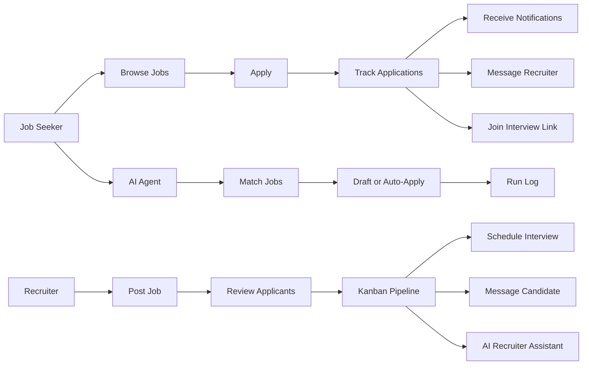

# SkillSync

SkillSync is a full-stack hiring platform that connects recruiters and job seekers in one workflow. It covers job posting, applications, interview scheduling, direct messaging, notifications, profile management, and AI-assisted recruiting and job-application automation.

The project is designed to feel like a real product rather than a demo shell. Recruiters can manage applicants through a kanban-style pipeline, schedule interviews, message candidates, and use AI to assist with decision-making. Job seekers can browse roles, apply, track applications, join interviews through pasted meeting links, and message recruiters directly. The platform also includes an AI agent that can draft or auto-submit applications based on job-fit matching and user preferences.

## Product Flow



## Key Features

- Authentication and role-based access for job seekers, recruiters, and admins
- Job posting and job browsing
- Application tracking and saved jobs
- Kanban-based recruiter pipeline for applicant management
- Manual interview scheduling with meeting link support
- Real-time messaging between recruiters and job seekers
- Notifications for applications and interviews
- Profile management for both user types
- AI-assisted recruiter chat for applicant insights
- AI job-seeker agent that can:
  - scan matching jobs
  - create drafts for review
  - auto-submit applications in `auto` mode
  - keep a visible run log of every decision

## AI Features

### Recruiter AI Assistant

On the Applicants page, recruiters can chat with an AI assistant that queries their applicant pool using natural language. It uses the current recruiter-scoped applicant data and resume text to answer questions like:

- "Who are my strongest Python candidates?"
- "Compare the top 3 applicants for the React Developer role"
- "Which candidates have 5+ years of experience?"

### Job Seeker AI Agent

Job seekers can enable an AI agent from the Agent Control Center. The agent:

- evaluates the user profile and preferences
- scans available jobs
- scores matches
- generates cover letters
- either creates drafts or auto-submits applications depending on mode
- records an activity log and a per-run decision log

This makes the project stand out as more than a standard job board. It combines workflow automation, AI-assisted matching, and real product logic.

## Tech Stack

### Backend

- Node.js
- Express
- MongoDB
- Mongoose
- Socket.IO
- Cloudinary
- Twilio SMS OTP
- Google Gemini AI integration

### Frontend

- React
- Vite
- Redux Toolkit
- React Router
- Tailwind CSS
- Socket.IO client
- React Hook Form
- React Icons and Lucide icons

## Project Structure

```text
SkillSync/
|-- Backend/
|   |-- controllers/
|   |-- services/
|   |-- models/
|   |-- routes/
|   |-- middleware/
|   |-- socket/
|   |-- tests/
|   `-- utils/
|-- Frontend/
|   |-- src/
|   |-- public/
|   |-- tests/
|   `-- vite.config.js
|-- README.md
`-- package.json
```

## Setup

Install dependencies for both apps:

```bash
npm run install:all
```

Run the backend:

```bash
npm run dev:backend
```

Run the frontend:

```bash
npm run dev:frontend
```

## Testing

Run all tests from the repository root:

```bash
npm test
```

Run backend tests only:

```bash
npm run test:backend
```

Run frontend tests only:

```bash
npm run test:frontend
```

## Why This Project Matters

SkillSync is not just a UI prototype. It demonstrates full-stack product thinking:

- structured role-based workflows
- real database-backed application flows
- live messaging and notifications
- interview coordination
- AI-supported recruiter decision-making
- AI-assisted job application automation

That makes it a strong portfolio project because it shows both engineering range and product judgment.

## Startup Angle

The most interesting startup direction is not just a generic job board. The stronger product wedge is the AI workflow layer around hiring and applicant management:

- recruiter copilot
- applicant ranking and screening
- AI summaries and recommendations
- application automation for candidates

## Notes

- The repo uses a hybrid structure: feature-based organization in the frontend where it helps, and layered organization where it is more practical.
- The AI agent includes both draft and auto-apply modes, plus a visible run log for transparency.
- Debug-only files were moved out of the main source tree to keep the repository cleaner.
